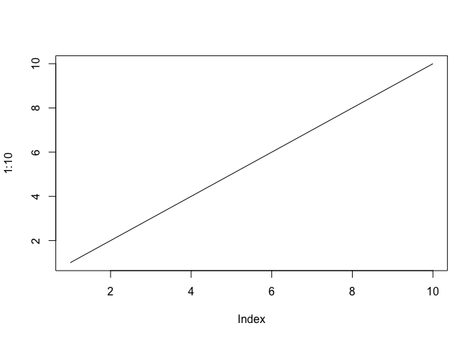
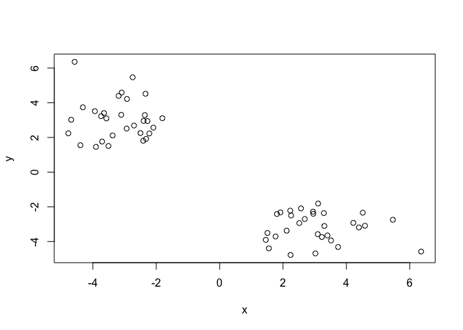
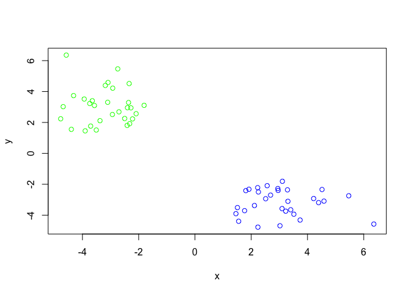
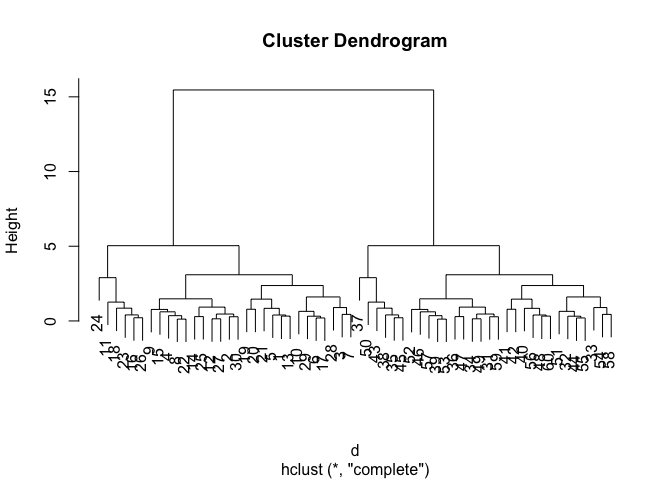
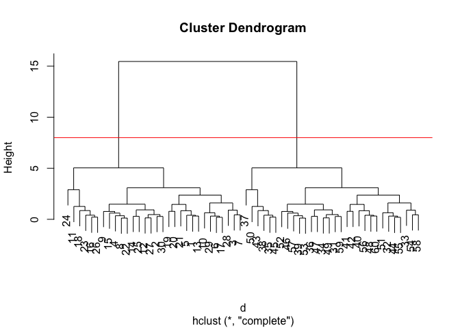
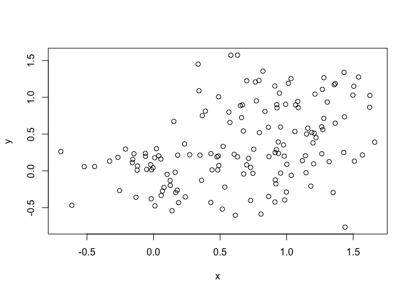
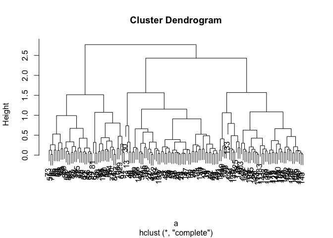
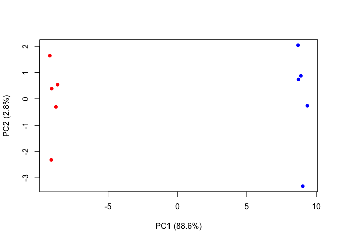

Untitled
================
Peirun Chen
10/25/2018

K-means clustering
------------------

our first example with **kmeans()** function

``` r
#example plot to see how R markdown works
plot(1:10,type = "l")
```



Back to kmeans

``` r
tmp <- c(rnorm(30,-3), rnorm(30,3))
x <- cbind(x=tmp, y=rev(tmp))
plot(x)
```



``` r
#Use the kmeans() function setting k to 2 and nstart=20 # 
k <- kmeans(x, centers=2, nstart=20)
k
```

    ## K-means clustering with 2 clusters of sizes 30, 30
    ## 
    ## Cluster means:
    ##           x         y
    ## 1  3.058327 -3.184851
    ## 2 -3.184851  3.058327
    ## 
    ## Clustering vector:
    ##  [1] 2 2 2 2 2 2 2 2 2 2 2 2 2 2 2 2 2 2 2 2 2 2 2 2 2 2 2 2 2 2 1 1 1 1 1
    ## [36] 1 1 1 1 1 1 1 1 1 1 1 1 1 1 1 1 1 1 1 1 1 1 1 1 1
    ## 
    ## Within cluster sum of squares by cluster:
    ## [1] 61.43802 61.43802
    ##  (between_SS / total_SS =  90.5 %)
    ## 
    ## Available components:
    ## 
    ## [1] "cluster"      "centers"      "totss"        "withinss"    
    ## [5] "tot.withinss" "betweenss"    "size"         "iter"        
    ## [9] "ifault"

How many points are in each cluster?

``` r
k$cluster
```

    ##  [1] 2 2 2 2 2 2 2 2 2 2 2 2 2 2 2 2 2 2 2 2 2 2 2 2 2 2 2 2 2 2 1 1 1 1 1
    ## [36] 1 1 1 1 1 1 1 1 1 1 1 1 1 1 1 1 1 1 1 1 1 1 1 1 1

plotx colored by kmean cluster assignment and add cluster center as blue points

``` r
palette(c("blue","green"))
plot(x,col=k$cluster)
```



Q. Repeat for k=3, which has the lower tot.withinss?

``` r
k3 <- kmeans(x,centers = 3,nstart = 20)
k3$ tot.withinss
```

    ## [1] 96.48777

``` r
k$ tot.withinss
```

    ## [1] 122.876

Hierarchical clustering in R
============================

let's try out the **hclust()** function for Hierarchical clustering in R. This function need a distance matrix input

``` r
d <- dist(x)
hc <- hclust(d)
plot(hc)
```



``` r
plot(hc)
#Draw a line on the dendrogram
abline(h=8,col="red")
```



``` r
#cut the tree to tyield cluster membrane vector
cutree(hc,h=8)
```

    ##  [1] 1 1 1 1 1 1 1 1 1 1 1 1 1 1 1 1 1 1 1 1 1 1 1 1 1 1 1 1 1 1 2 2 2 2 2
    ## [36] 2 2 2 2 2 2 2 2 2 2 2 2 2 2 2 2 2 2 2 2 2 2 2 2 2

\#\#\# A more real example

``` r
# Step 1. Generate some example data for clustering
x <- rbind(
 matrix(rnorm(100, mean=0, sd = 0.3), ncol = 2), # c1
 matrix(rnorm(100, mean = 1, sd = 0.3), ncol = 2), # c2
 matrix(c(rnorm(50, mean = 1, sd = 0.3), # c3
 rnorm(50, mean = 0, sd = 0.3)), ncol = 2))
colnames(x) <- c("x", "y")
# Step 2. Plot the data without clustering
plot(x)
```



``` r
# Step 3. Generate colors for known clusters
# (just so we can compare to hclust results)
col <- as.factor( rep(c("c1","c2","c3"), each=50) )
palette (c ("red","blue","black"))
plot(x, col=col,pch=20)
```


``` r
# Q. Use the dist(), hclust(), plot() and cutree()
a <- dist(x)
hc <- hclust(a)
plot(hc)
```



``` r
# functions to return 2 and 3 clusters
grp.2 <- cutree(hc,h=2.5)
grp.3 <- cutree(hc,h=2)
```

Q. How does this compare to your known 'col' groups?

``` r
table(grp.3,col)
```

    ##      col
    ## grp.3 c1 c2 c3
    ##     1 47  1  7
    ##     2  2  6 42
    ##     3  1 43  1

\# principal component analysis

lets makes up some data with quite a few dimensions

``` r
## Initialize a blank 100 row by 10 column matrix
mydata <- matrix(nrow=100, ncol=10)

## Lets label the rows gene1, gene2 etc. to gene100
rownames(mydata) <- paste("gene", 1:100, sep="")

## Lets label the first 5 columns wt1, wt2, wt3, wt4 and wt5
## and the last 5 ko1, ko2 etc. to ko5 (for "knock-out")
colnames(mydata) <- c( paste("wt", 1:5, sep=""),
 paste("ko", 1:5, sep="") )

## Fill in some fake read counts
for(i in 1:nrow(mydata)) {
 wt.values <- rpois(5, lambda=sample(x=10:1000, size=1))
 ko.values <- rpois(5, lambda=sample(x=10:1000, size=1))

 mydata[i,] <- c(wt.values, ko.values)
}
head(mydata)
```

    ##       wt1 wt2 wt3 wt4 wt5 ko1 ko2 ko3 ko4 ko5
    ## gene1 798 808 776 785 761 329 326 320 344 364
    ## gene2 783 746 740 739 741  45  45  46  57  34
    ## gene3 607 637 599 595 594 292 281 288 276 257
    ## gene4 821 868 902 819 924 357 331 325 344 335
    ## gene5 900 841 846 792 856 764 807 748 754 761
    ## gene6 720 706 713 788 730 665 625 628 653 625

Now let's try to find structure in this data with **prompt**

``` r
pca <- prcomp(t(mydata),scale=T)
pca
```

    ## Standard deviations:
    ##  [1] 9.412816e+00 1.672428e+00 1.433720e+00 1.395231e+00 1.214735e+00
    ##  [6] 1.057913e+00 9.327205e-01 7.807832e-01 7.247820e-01 3.390636e-15
    ## 
    ## Rotation:
    ##                 PC1           PC2           PC3           PC4          PC5
    ## gene1   -0.10602699  0.0249710927 -0.0212735780  0.0093082477  0.005896500
    ## gene2   -0.10615360 -0.0034947541 -0.0159975767 -0.0115391453  0.011104541
    ## gene3   -0.10579713  0.0019624522 -0.0206435073 -0.0014685773  0.033591783
    ## gene4   -0.10546069 -0.0202887872  0.0523651597 -0.0017437244  0.018896077
    ## gene5   -0.08677851 -0.1296121378 -0.1036422458 -0.3072381712  0.152440769
    ## gene6   -0.09375812 -0.0469828218 -0.0797115693  0.2458834065 -0.019860864
    ## gene7   -0.10583807 -0.0055495510 -0.0047695556  0.0042421798 -0.037809339
    ## gene8   -0.10387273 -0.0312884813 -0.0630268543  0.0436484522  0.059897057
    ## gene9    0.09932296 -0.0141330734  0.0392699523 -0.0123342823  0.223237562
    ## gene10  -0.10609680 -0.0028406899 -0.0157345907  0.0049012422  0.009353230
    ## gene11   0.10436184 -0.0349955026 -0.0158257984 -0.0890106664  0.045441269
    ## gene12  -0.10425403 -0.0760638500  0.0399395203  0.0072712709  0.077785558
    ## gene13  -0.09497870  0.0087517198 -0.0755866556  0.1202675573 -0.006494675
    ## gene14   0.10203022 -0.0765921540 -0.0778914380  0.0904537878 -0.015296432
    ## gene15   0.10414541  0.0667676928 -0.0228390209 -0.0056928479  0.053102032
    ## gene16   0.10598924 -0.0103989119  0.0076169075 -0.0218647552 -0.022221832
    ## gene17   0.10603775  0.0041029648 -0.0037520197 -0.0183190749 -0.013954479
    ## gene18   0.10563207  0.0042004848  0.0175424198  0.0320673875 -0.037339087
    ## gene19   0.10587408 -0.0255110354  0.0087979661 -0.0436908168  0.017802359
    ## gene20  -0.05142644  0.4704971756 -0.1244539525  0.0319513597 -0.237320701
    ## gene21   0.10597492  0.0201854998  0.0118811414 -0.0104124082  0.005685241
    ## gene22  -0.10605850  0.0043107178  0.0013263658 -0.0055103169  0.018608612
    ## gene23  -0.10462437  0.0258036463 -0.0284775481  0.0524698326  0.072550995
    ## gene24   0.10614072  0.0093911899  0.0095409017 -0.0073725255 -0.002855466
    ## gene25   0.10594832  0.0015778589 -0.0046131881  0.0085519592 -0.002667612
    ## gene26  -0.08228191 -0.2477637716 -0.2054538125 -0.1305940975  0.042684763
    ## gene27   0.10613359  0.0019799264 -0.0071773354 -0.0038766431 -0.014675328
    ## gene28   0.10536598  0.0243408249 -0.0341610950 -0.0340326330  0.064794863
    ## gene29  -0.09295793  0.0360116330 -0.0049510635  0.2175267323  0.026319603
    ## gene30   0.10596934 -0.0169611139  0.0140742309 -0.0027755800  0.032398830
    ## gene31   0.10319829  0.0121115719  0.0271097995 -0.0310773996 -0.061988456
    ## gene32   0.10578339  0.0382494378  0.0178696840 -0.0145062221 -0.006466801
    ## gene33   0.10436527  0.0235429759 -0.0385933361  0.0150164578 -0.026291809
    ## gene34  -0.09940195 -0.0265194393  0.1088878817 -0.1497523437  0.004543265
    ## gene35  -0.10010315 -0.0119920045  0.0346160316  0.1838874799 -0.016131716
    ## gene36   0.10569538  0.0073362431  0.0280943796  0.0237234429 -0.024259420
    ## gene37   0.10017509 -0.0756341169  0.0320763835  0.1598456927  0.027167969
    ## gene38   0.10541470  0.0435467872  0.0017657769  0.0321701021 -0.060614112
    ## gene39  -0.01356916  0.5449829603 -0.0516146254  0.0213329804  0.167610644
    ## gene40   0.10360091  0.0048649660  0.0267962120  0.0498950036 -0.057241204
    ## gene41   0.10153756 -0.0565872135 -0.1247179891 -0.1140661063 -0.064320234
    ## gene42  -0.10122409  0.0374768672  0.0636800610  0.0008405894  0.132061173
    ## gene43   0.10551793  0.0306557317 -0.0098564224  0.0500485679  0.007939871
    ## gene44   0.10576068  0.0210902933 -0.0268065646  0.0039108911 -0.033797886
    ## gene45  -0.10608046 -0.0167837223 -0.0215470923  0.0085736102  0.012697905
    ## gene46   0.09374581 -0.0425306334 -0.1232795966  0.0719450627  0.239894117
    ## gene47  -0.10588421 -0.0195822492 -0.0036831282  0.0117955067  0.018847305
    ## gene48   0.10151813 -0.0137652420 -0.0491501854  0.0045763371  0.043957450
    ## gene49   0.09852293 -0.1154775948 -0.1193424889 -0.0948597761  0.047601959
    ## gene50   0.10450315  0.0404451684 -0.0093476662  0.0051044679  0.084674903
    ## gene51  -0.01477498  0.3783762571 -0.1098510007 -0.4050842715  0.254575001
    ## gene52   0.10236162  0.0734711399  0.0102773127 -0.1069594437 -0.058356165
    ## gene53   0.10606368 -0.0140554365 -0.0072803132 -0.0064661240 -0.017852533
    ## gene54  -0.06664932  0.1403771978  0.3199351857  0.2604364016  0.111811037
    ## gene55   0.10486217 -0.0014461000 -0.0542345455 -0.0152186937 -0.079676480
    ## gene56   0.10406493  0.0457126443  0.0458593285 -0.0336428024 -0.095687775
    ## gene57   0.10583012 -0.0200235999 -0.0091046134 -0.0004759633 -0.010519837
    ## gene58   0.09142140 -0.0747555547  0.3009959146  0.0841213444  0.050708172
    ## gene59  -0.10580409  0.0042532961  0.0093953923  0.0478187283 -0.031693635
    ## gene60   0.07584303 -0.2977392398 -0.2090976113  0.0379196842  0.176831437
    ## gene61   0.07543936 -0.0762336979  0.2949552264  0.0920546138  0.412540949
    ## gene62  -0.10577603 -0.0079177254 -0.0005963851  0.0482785490 -0.012016778
    ## gene63  -0.10506971 -0.0066183185 -0.0351190941 -0.0532846694  0.057969878
    ## gene64  -0.10598465 -0.0108615577  0.0040170816 -0.0136967186  0.013244804
    ## gene65  -0.09364159 -0.0756435152 -0.0905346774 -0.1019427484  0.007825653
    ## gene66  -0.10523898  0.0290875655  0.0274168973 -0.0679578606 -0.033720285
    ## gene67  -0.10615419  0.0011709612 -0.0013644957  0.0159376373  0.003173776
    ## gene68   0.10609521 -0.0027907000  0.0164831481 -0.0070653119 -0.017336253
    ## gene69   0.10101092  0.0343257684  0.0450601638  0.0090948828 -0.149711720
    ## gene70   0.10002449  0.0817505480  0.1253605982  0.0076012834 -0.187568684
    ## gene71  -0.10614511 -0.0029333140  0.0064572560  0.0153994553  0.004538824
    ## gene72  -0.09614373  0.1164208455 -0.0053624791  0.1556957151  0.097575782
    ## gene73  -0.10529592  0.0219732650  0.0128966926 -0.0021505833 -0.001725056
    ## gene74  -0.10603698  0.0185086716 -0.0107524321  0.0115315861  0.010881887
    ## gene75   0.10583020  0.0329593468  0.0006884626  0.0238560724 -0.003892352
    ## gene76  -0.10528581  0.0528342457 -0.0019619145 -0.0126117278  0.022650648
    ## gene77   0.05609352  0.0981131236 -0.2855067590  0.0995891741  0.470006722
    ## gene78  -0.10607582 -0.0003695024  0.0110607422 -0.0245230089  0.026789122
    ## gene79  -0.08290333 -0.1102994428  0.2682999640  0.0722073875 -0.036335259
    ## gene80   0.02090628 -0.0101030393 -0.5318972783  0.3914366683 -0.163127090
    ## gene81   0.10494964 -0.0020422836 -0.0117079806  0.0229981073  0.050702596
    ## gene82   0.10608608 -0.0077112998  0.0002285026  0.0221440847  0.001917648
    ## gene83  -0.10351132  0.0322535663 -0.0262714207  0.0140342190 -0.069538684
    ## gene84  -0.10561215  0.0186238505 -0.0080575781 -0.0461363567  0.029966672
    ## gene85   0.10583081  0.0235519799  0.0045909493  0.0067332423 -0.025643145
    ## gene86  -0.10449917 -0.0311433170 -0.0788973873 -0.0314972917 -0.041881860
    ## gene87   0.10605065  0.0097291388  0.0209534502  0.0131342437  0.026505404
    ## gene88   0.10588440  0.0180796805  0.0188148469 -0.0013195004 -0.050511918
    ## gene89  -0.10591513 -0.0240057686  0.0048412108  0.0058917953  0.016729274
    ## gene90   0.10530983  0.0259774761  0.0269777974 -0.0126883082  0.018887595
    ## gene91   0.10602185 -0.0090171965 -0.0014963170  0.0030226632 -0.029701023
    ## gene92   0.10536014  0.0455869491  0.0032603375  0.0043892671 -0.038384919
    ## gene93   0.10612130  0.0146870697  0.0034020542 -0.0063741821 -0.019874279
    ## gene94   0.10384755  0.0100361106 -0.0445738538  0.0191564149  0.143879414
    ## gene95  -0.10575889  0.0040822690 -0.0119217817  0.0314843006 -0.028454976
    ## gene96  -0.07878075 -0.0807291610 -0.0361845567 -0.3638095290 -0.181817523
    ## gene97   0.10602748 -0.0076297518 -0.0103037602  0.0118057159  0.021349913
    ## gene98   0.10502118  0.0161031578 -0.0692306091  0.0110948114 -0.053951304
    ## gene99  -0.10386278 -0.0557337857 -0.0285264051  0.0364119904  0.056381320
    ## gene100 -0.10589847  0.0114249854 -0.0263568852  0.0429243728 -0.009085588
    ##                   PC6          PC7          PC8           PC9
    ## gene1   -0.0208869946  0.017782858 -0.020601384 -0.0101908660
    ## gene2    0.0160364170  0.014481560  0.012995060 -0.0055678496
    ## gene3    0.0462625768 -0.020143182 -0.052713985  0.0494915346
    ## gene4    0.0308990965 -0.029234356 -0.056138173 -0.0819551560
    ## gene5   -0.1683961913  0.040179075 -0.109581466 -0.0996121431
    ## gene6    0.1512277487  0.070708973  0.281880700 -0.0999782546
    ## gene7    0.0035137265 -0.026983828 -0.086743552  0.0032675165
    ## gene8   -0.0154167677  0.161430174  0.037367586 -0.0254333989
    ## gene9    0.0844915297  0.013541261  0.028085815  0.2750997351
    ## gene10  -0.0252620257 -0.024669982  0.033929612  0.0034067395
    ## gene11  -0.0089135626 -0.089454806  0.046978768  0.0894592907
    ## gene12   0.0535702903  0.017127999  0.083376476  0.0391622682
    ## gene13  -0.3270161597  0.175790282 -0.029507900  0.1600509236
    ## gene14   0.1376408442  0.087252891  0.025261226  0.0902708969
    ## gene15   0.0287063383 -0.111540126 -0.062588720  0.1163385410
    ## gene16  -0.0079089093 -0.020124947 -0.043343293  0.0443139281
    ## gene17  -0.0130316296 -0.020224500 -0.034243845  0.0532849065
    ## gene18  -0.0686919877  0.028415183 -0.022437922  0.0256577386
    ## gene19   0.0186557996 -0.008275219 -0.002484950  0.0207418325
    ## gene20   0.1474219685 -0.026082500  0.086757882  0.0118928405
    ## gene21  -0.0046379018 -0.054996168  0.004312976 -0.0336220686
    ## gene22   0.0091228725 -0.035831208 -0.048951911  0.0125130214
    ## gene23   0.0077656588 -0.101111222  0.070517097  0.0534506088
    ## gene24  -0.0274799890 -0.008303194  0.003320750  0.0265270097
    ## gene25  -0.0469222005 -0.004570056  0.022345780  0.0684076126
    ## gene26  -0.1429566826 -0.258983975  0.200707243 -0.0032825203
    ## gene27  -0.0331867077 -0.012575121 -0.011023052 -0.0106023149
    ## gene28   0.0226758894  0.007899226 -0.071473450 -0.0139218362
    ## gene29  -0.2724661330 -0.157331646 -0.211789776  0.1033009674
    ## gene30  -0.0196468425 -0.004091793  0.003695096  0.0589141124
    ## gene31   0.1409857720  0.002242289  0.128593143  0.1667475035
    ## gene32  -0.0428403390 -0.027303166  0.031190449 -0.0071907177
    ## gene33  -0.0500656095 -0.013415874 -0.191908830 -0.0811868305
    ## gene34   0.1366234287 -0.037432763 -0.230595156  0.0028129701
    ## gene35   0.1662264669 -0.042679406 -0.124482675  0.0463676992
    ## gene36  -0.0065782098 -0.013494072  0.014132567  0.1079905106
    ## gene37  -0.1153233183  0.007557378 -0.133438152  0.1753474253
    ## gene38  -0.0446962522 -0.013243033 -0.019324889 -0.0122664012
    ## gene39   0.2249450441  0.209044056 -0.073476494  0.1170714545
    ## gene40   0.0074265198 -0.132137597  0.135565647  0.1470074824
    ## gene41   0.0201968797 -0.125464780  0.000516603  0.0061565119
    ## gene42  -0.1134343060  0.036729421  0.251600641 -0.0002399299
    ## gene43  -0.0488874447  0.016064704  0.015835960 -0.0711959952
    ## gene44  -0.0005574577 -0.030216820  0.006374731 -0.0840642384
    ## gene45  -0.0052816786  0.013316806  0.032093011  0.0074893297
    ## gene46  -0.1293866730  0.078331060  0.328282012  0.0231937396
    ## gene47   0.0475665778  0.009844311  0.059135058  0.0038867447
    ## gene48   0.1215500112 -0.217801713  0.139903913 -0.1291280839
    ## gene49   0.0901326556 -0.093241114 -0.235495871  0.0627775779
    ## gene50   0.0589712456 -0.077656578  0.091405501 -0.0727253053
    ## gene51  -0.3027612661 -0.160085403 -0.017799139  0.1704736219
    ## gene52   0.0746320686  0.068890283  0.173035849  0.0282717993
    ## gene53  -0.0359360487 -0.019999679  0.003166437  0.0226244836
    ## gene54  -0.2262396137 -0.290875141 -0.148042085 -0.2964494603
    ## gene55   0.0576482153 -0.025813272 -0.032203576  0.0969149805
    ## gene56   0.0288582978  0.029767749 -0.132913016 -0.0638176094
    ## gene57   0.0085199646  0.061857048  0.004651652  0.0728479112
    ## gene58   0.1073777807  0.047755309  0.134929082 -0.1636348484
    ## gene59   0.0280575024  0.034734608 -0.009725078 -0.0010671023
    ## gene60   0.0238617676  0.317672138 -0.157049273 -0.0152080138
    ## gene61   0.1227288671 -0.106952110 -0.075454230  0.0726470054
    ## gene62   0.0274539872  0.052579524  0.009193119  0.0293911120
    ## gene63  -0.0290588411 -0.046826099  0.094507842  0.0287546634
    ## gene64   0.0243334564  0.054897217  0.023303948 -0.0176423108
    ## gene65   0.1142395170 -0.369742392  0.136986764  0.2178358372
    ## gene66  -0.0086781773  0.067078219  0.006460008 -0.0149472839
    ## gene67   0.0199375998  0.026587775 -0.001941093  0.0010019549
    ## gene68  -0.0044696863  0.022822437 -0.040869307  0.0118781053
    ## gene69  -0.1563187860 -0.134918720 -0.042788540 -0.1445841731
    ## gene70  -0.0211973568 -0.019665717  0.068827197 -0.1138160172
    ## gene71   0.0072819692 -0.004227759 -0.031132519  0.0303219432
    ## gene72  -0.1244122864 -0.160477403  0.225126653 -0.1458411187
    ## gene73   0.0374223866  0.051871209  0.024459739  0.1491159622
    ## gene74   0.0053519728  0.022019184 -0.021771526  0.0518281807
    ## gene75  -0.0368881235 -0.043350485 -0.022246888  0.0082541540
    ## gene76   0.0575870114  0.076292114  0.014023105  0.0115780202
    ## gene77   0.3085878789 -0.135901102 -0.139625798 -0.2989169323
    ## gene78   0.0148627257 -0.004106041  0.020753825 -0.0094903423
    ## gene79   0.2353282419 -0.262128723 -0.003921352  0.3783248650
    ## gene80   0.0256378203 -0.205008944 -0.073081501  0.0506559892
    ## gene81  -0.0424887560  0.122441166 -0.026653059  0.0815940822
    ## gene82  -0.0326352260 -0.020771850  0.002991901 -0.0175155789
    ## gene83   0.0333096006 -0.038491562 -0.210752301  0.1324822608
    ## gene84   0.0505089238  0.036581540 -0.024107214 -0.0391214703
    ## gene85  -0.0580891837  0.022287721  0.014804576 -0.0353880414
    ## gene86  -0.0395691574 -0.098452319  0.058635806  0.0174872634
    ## gene87  -0.0178248316 -0.018200636  0.015870379  0.0189900071
    ## gene88  -0.0205782309 -0.020463828  0.024544330  0.0078662971
    ## gene89   0.0234270041  0.055152308 -0.033092655  0.0023161916
    ## gene90   0.0889785414 -0.030983332  0.066316786 -0.0390089677
    ## gene91  -0.0436788317 -0.001588445 -0.024392768 -0.0054993115
    ## gene92   0.0280724602 -0.063146992 -0.078449412  0.0243495979
    ## gene93  -0.0070566658 -0.025459070  0.017504113  0.0139925700
    ## gene94  -0.0157559295  0.036709758  0.109685803 -0.0128613776
    ## gene95   0.0259599182  0.068098437 -0.027831253  0.0229935860
    ## gene96   0.2498432907 -0.116147365 -0.033574845 -0.2775472937
    ## gene97   0.0117101918 -0.011290850 -0.007796415 -0.0666764182
    ## gene98  -0.0159209596 -0.040122060 -0.074483087 -0.0703618025
    ## gene99  -0.0002968527 -0.112248030 -0.159872471 -0.0089762666
    ## gene100 -0.0099111384 -0.006716291  0.002454193  0.0372716519
    ##                  PC10
    ## gene1   -0.3440920200
    ## gene2   -0.2480248875
    ## gene3   -0.0412895991
    ## gene4    0.0477500848
    ## gene5    0.2170991056
    ## gene6    0.1569130861
    ## gene7    0.0068363292
    ## gene8    0.0185883725
    ## gene9   -0.1371134441
    ## gene10   0.0442769722
    ## gene11  -0.0230006038
    ## gene12  -0.1284295464
    ## gene13  -0.0430130933
    ## gene14  -0.1073098225
    ## gene15   0.0997712898
    ## gene16   0.0461069346
    ## gene17  -0.0029310152
    ## gene18  -0.0134129329
    ## gene19   0.0250625080
    ## gene20  -0.1596305630
    ## gene21   0.0078600065
    ## gene22   0.0197766781
    ## gene23  -0.0327087419
    ## gene24   0.0123985060
    ## gene25   0.0223951024
    ## gene26  -0.0296119185
    ## gene27  -0.0284942614
    ## gene28   0.0399197137
    ## gene29  -0.0982775468
    ## gene30   0.0350191117
    ## gene31   0.2715439518
    ## gene32  -0.0105513771
    ## gene33  -0.0978944600
    ## gene34  -0.0289016743
    ## gene35   0.0876717871
    ## gene36   0.0292805213
    ## gene37  -0.0770047253
    ## gene38  -0.0899483099
    ## gene39   0.1243034594
    ## gene40  -0.0093187662
    ## gene41   0.1259707544
    ## gene42   0.0306925647
    ## gene43  -0.0459584807
    ## gene44  -0.0274912011
    ## gene45  -0.0170073185
    ## gene46   0.0991117290
    ## gene47   0.0037228940
    ## gene48  -0.0921421784
    ## gene49  -0.0799152099
    ## gene50   0.0419232345
    ## gene51  -0.0006316917
    ## gene52  -0.0352454867
    ## gene53   0.0229886091
    ## gene54   0.1163985304
    ## gene55  -0.0238951459
    ## gene56   0.0600054276
    ## gene57  -0.0124035410
    ## gene58  -0.0266813048
    ## gene59   0.0215076137
    ## gene60  -0.1496230691
    ## gene61   0.3251468569
    ## gene62  -0.0372193501
    ## gene63   0.0852460628
    ## gene64   0.0368867018
    ## gene65  -0.0438263558
    ## gene66   0.1818005039
    ## gene67  -0.0073002638
    ## gene68  -0.0131334099
    ## gene69   0.0780362553
    ## gene70  -0.0073902521
    ## gene71   0.0515812929
    ## gene72  -0.2228529437
    ## gene73   0.0771834588
    ## gene74  -0.0185183743
    ## gene75  -0.0738977441
    ## gene76   0.1077601971
    ## gene77  -0.1685638958
    ## gene78   0.0528979408
    ## gene79  -0.1787706708
    ## gene80   0.2988047194
    ## gene81   0.0641942310
    ## gene82   0.0181794135
    ## gene83   0.1211940224
    ## gene84  -0.0296758983
    ## gene85  -0.0460649525
    ## gene86   0.1004221626
    ## gene87   0.0023562185
    ## gene88  -0.0362197168
    ## gene89   0.0107310638
    ## gene90   0.0235341806
    ## gene91  -0.0054904017
    ## gene92  -0.0282597037
    ## gene93  -0.0040778030
    ## gene94  -0.0339853037
    ## gene95   0.0194982756
    ## gene96   0.0476856295
    ## gene97  -0.0058388836
    ## gene98  -0.0387055146
    ## gene99  -0.0187663203
    ## gene100 -0.0092766006

Make a PC plot of PC1 vs PC2. For this I use the "$x" component of out output (eg.pca$x)

``` r
## A basic PC1 vs PC2 2-D plot
plot(pca$x[,1], pca$x[,2]) 
```


Let's see how well our PC are doing

``` r
## Precent variance is often more informative to look at
pca.var <- pca$sdev^2
pca.var.per <- round(pca.var/sum(pca.var)*100, 1)

pca.var.per
```

    ##  [1] 88.6  2.8  2.1  1.9  1.5  1.1  0.9  0.6  0.5  0.0

A vector of colors for wt and ko samples

``` r
## A vector of colors for wt and ko samples
colvec <- colnames(mydata)
colvec[grep("wt", colvec)] <- "red"
colvec[grep("ko", colvec)] <- "blue"

plot(pca$x[,1], pca$x[,2], col=colvec, pch=16,
 xlab=paste0("PC1 (", pca.var.per[1], "%)"),
 ylab=paste0("PC2 (", pca.var.per[2], "%)"))
```


``` r
plot(pca$x[,1], pca$x[,2], col=colvec, pch=16,
 xlab=paste0("PC1 (", pca.var.per[1], "%)"),
 ylab=paste0("PC2 (", pca.var.per[2], "%)"))
## Click to identify which sample is which
identify(pca$x[,1], pca$x[,2], labels=colnames(mydata)) 
```



    ## integer(0)
