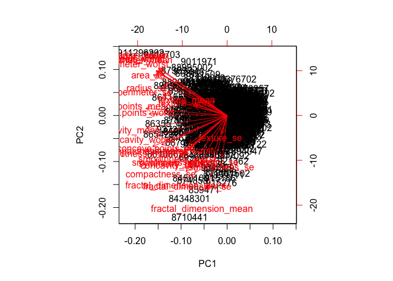
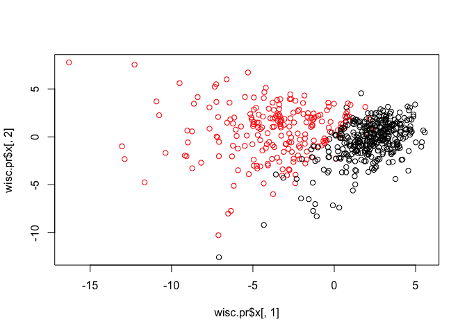
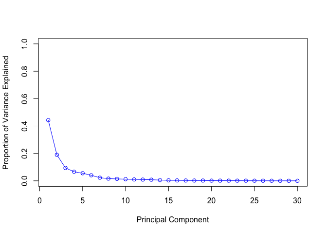
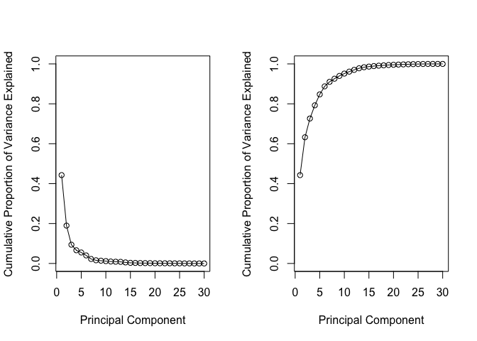
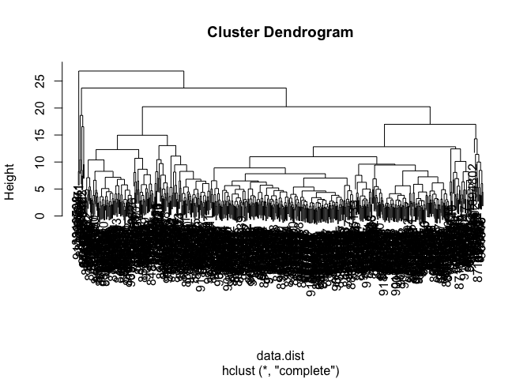

Hand on 9
================
Peirun Chen

Preparing the data
==================

``` r
wisc.df <- read.csv("https://bioboot.github.io/bimm143_S18/class-material/WisconsinCancer.csv")
```

The id and diagnosis columns will not be used for most of the following steps. Use as.matrix() to convert the other features (i.e. columns) of the data (in columns 3 through 32) to a matrix.

``` r
wisc.data <- as.matrix(wisc.df[3:32])
```

Set the row names of data

``` r
rownames(wisc.data) <- wisc.df$id
```

setup a separate new vector called diagnosis to be 1 if a diagnosis is malignant ("M") and 0 otherwise. Note that R coerces TRUE to 1 and FALSE to 0.

``` r
table(wisc.df$diagnosis)
```

    ## 
    ##   B   M 
    ## 357 212

``` r
diagnosis <- as.numeric(wisc.df$diagnosis=="M")
sum(diagnosis)
```

    ## [1] 212

How many variables/features in the data are suffixed with \_mean?

``` r
colnames(wisc.data)
```

    ##  [1] "radius_mean"             "texture_mean"           
    ##  [3] "perimeter_mean"          "area_mean"              
    ##  [5] "smoothness_mean"         "compactness_mean"       
    ##  [7] "concavity_mean"          "concave.points_mean"    
    ##  [9] "symmetry_mean"           "fractal_dimension_mean" 
    ## [11] "radius_se"               "texture_se"             
    ## [13] "perimeter_se"            "area_se"                
    ## [15] "smoothness_se"           "compactness_se"         
    ## [17] "concavity_se"            "concave.points_se"      
    ## [19] "symmetry_se"             "fractal_dimension_se"   
    ## [21] "radius_worst"            "texture_worst"          
    ## [23] "perimeter_worst"         "area_worst"             
    ## [25] "smoothness_worst"        "compactness_worst"      
    ## [27] "concavity_worst"         "concave.points_worst"   
    ## [29] "symmetry_worst"          "fractal_dimension_worst"

``` r
s <- grep("_mean",colnames(wisc.data))
length(s)
```

    ## [1] 10

Performing PCA
==============

check if the data need to be scaled before performing PCA because of different units of measurement or significantly different variances.

``` r
colMeans(wisc.data)
```

    ##             radius_mean            texture_mean          perimeter_mean 
    ##            1.412729e+01            1.928965e+01            9.196903e+01 
    ##               area_mean         smoothness_mean        compactness_mean 
    ##            6.548891e+02            9.636028e-02            1.043410e-01 
    ##          concavity_mean     concave.points_mean           symmetry_mean 
    ##            8.879932e-02            4.891915e-02            1.811619e-01 
    ##  fractal_dimension_mean               radius_se              texture_se 
    ##            6.279761e-02            4.051721e-01            1.216853e+00 
    ##            perimeter_se                 area_se           smoothness_se 
    ##            2.866059e+00            4.033708e+01            7.040979e-03 
    ##          compactness_se            concavity_se       concave.points_se 
    ##            2.547814e-02            3.189372e-02            1.179614e-02 
    ##             symmetry_se    fractal_dimension_se            radius_worst 
    ##            2.054230e-02            3.794904e-03            1.626919e+01 
    ##           texture_worst         perimeter_worst              area_worst 
    ##            2.567722e+01            1.072612e+02            8.805831e+02 
    ##        smoothness_worst       compactness_worst         concavity_worst 
    ##            1.323686e-01            2.542650e-01            2.721885e-01 
    ##    concave.points_worst          symmetry_worst fractal_dimension_worst 
    ##            1.146062e-01            2.900756e-01            8.394582e-02

``` r
apply(wisc.data, 2, sd)
```

    ##             radius_mean            texture_mean          perimeter_mean 
    ##            3.524049e+00            4.301036e+00            2.429898e+01 
    ##               area_mean         smoothness_mean        compactness_mean 
    ##            3.519141e+02            1.406413e-02            5.281276e-02 
    ##          concavity_mean     concave.points_mean           symmetry_mean 
    ##            7.971981e-02            3.880284e-02            2.741428e-02 
    ##  fractal_dimension_mean               radius_se              texture_se 
    ##            7.060363e-03            2.773127e-01            5.516484e-01 
    ##            perimeter_se                 area_se           smoothness_se 
    ##            2.021855e+00            4.549101e+01            3.002518e-03 
    ##          compactness_se            concavity_se       concave.points_se 
    ##            1.790818e-02            3.018606e-02            6.170285e-03 
    ##             symmetry_se    fractal_dimension_se            radius_worst 
    ##            8.266372e-03            2.646071e-03            4.833242e+00 
    ##           texture_worst         perimeter_worst              area_worst 
    ##            6.146258e+00            3.360254e+01            5.693570e+02 
    ##        smoothness_worst       compactness_worst         concavity_worst 
    ##            2.283243e-02            1.573365e-01            2.086243e-01 
    ##    concave.points_worst          symmetry_worst fractal_dimension_worst 
    ##            6.573234e-02            6.186747e-02            1.806127e-02

Execute PCA with the prcomp() function on the wisc.data, scaling if appropriate, and assign the output model to wisc.pr.

``` r
wisc.pr <- prcomp(wisc.data, scale= T)
summary(wisc.pr)
```

    ## Importance of components:
    ##                           PC1    PC2     PC3     PC4     PC5     PC6
    ## Standard deviation     3.6444 2.3857 1.67867 1.40735 1.28403 1.09880
    ## Proportion of Variance 0.4427 0.1897 0.09393 0.06602 0.05496 0.04025
    ## Cumulative Proportion  0.4427 0.6324 0.72636 0.79239 0.84734 0.88759
    ##                            PC7     PC8    PC9    PC10   PC11    PC12
    ## Standard deviation     0.82172 0.69037 0.6457 0.59219 0.5421 0.51104
    ## Proportion of Variance 0.02251 0.01589 0.0139 0.01169 0.0098 0.00871
    ## Cumulative Proportion  0.91010 0.92598 0.9399 0.95157 0.9614 0.97007
    ##                           PC13    PC14    PC15    PC16    PC17    PC18
    ## Standard deviation     0.49128 0.39624 0.30681 0.28260 0.24372 0.22939
    ## Proportion of Variance 0.00805 0.00523 0.00314 0.00266 0.00198 0.00175
    ## Cumulative Proportion  0.97812 0.98335 0.98649 0.98915 0.99113 0.99288
    ##                           PC19    PC20   PC21    PC22    PC23   PC24
    ## Standard deviation     0.22244 0.17652 0.1731 0.16565 0.15602 0.1344
    ## Proportion of Variance 0.00165 0.00104 0.0010 0.00091 0.00081 0.0006
    ## Cumulative Proportion  0.99453 0.99557 0.9966 0.99749 0.99830 0.9989
    ##                           PC25    PC26    PC27    PC28    PC29    PC30
    ## Standard deviation     0.12442 0.09043 0.08307 0.03987 0.02736 0.01153
    ## Proportion of Variance 0.00052 0.00027 0.00023 0.00005 0.00002 0.00000
    ## Cumulative Proportion  0.99942 0.99969 0.99992 0.99997 1.00000 1.00000

Interpreting PCA results
========================

Create a biplot PC1 VS PC2. the wisc.pr using the biplot() function

``` r
biplot(wisc.pr)
```



generate a more standard scatter plot of each observation along principal components 1 and 2

``` r
#30 means there are 30 dimensions of PC
dim(wisc.pr$x)
```

    ## [1] 569  30

``` r
#30 means there are 30 dimensions of PC
plot(wisc.pr$x[,1],wisc.pr$x[,2],col=diagnosis+1)
```



``` r
#because 0 has no color in palette, we add 1 so we can see 0
```

Variance explained
==================

``` r
pr.var <- wisc.pr$sdev^2
sum(pr.var)
```

    ## [1] 30

``` r
pve=pr.var/30
plot(pve,type = "o",xlab = "Principal Component",ylab = "Proportion of Variance Explained",col="blue",ylim = c(0, 1))
```



``` r
# Alternative scree plot of the same data, note data driven y-axis
barplot(pve, ylab = "Precent of Variance Explained",
     names.arg=paste0("PC",1:length(pve)), las=2, axes = FALSE)
axis(2, at=pve, labels=round(pve,2)*100 )
```


``` r
# Plot cumulative proportion of variance explained
plot(cumsum(pve), xlab = "Principal Component", 
     ylab = "Cumulative Proportion of Variance Explained", 
     ylim = c(0, 1), type = "o")
```


``` r
par(mfrow=c(1,2))
    plot(pve, xlab = "Principal Component", 
     ylab = "Cumulative Proportion of Variance Explained", 
     ylim = c(0, 1), type = "o")
    plot(cumsum(pve), xlab = "Principal Component", 
     ylab = "Cumulative Proportion of Variance Explained", 
     ylim = c(0, 1), type = "o")
```



Hierarchical clustering of case data
====================================

Scale the wisc.data and assign the result to data.scaled.

``` r
# Scale the wisc.data data: data.scaled
data.scaled <- scale(wisc.data)
```

we need a distance matric for hierarchical clustering input

``` r
data.dist <- dist(data.scaled)
```

create a hierarchical clustering model using complete linkage. use hclust() and assign the result to wisc.hclust

``` r
wisc.hclust <- hclust(data.dist,method = "complete")
```

plot our tree

``` r
plot(wisc.hclust)
```



Clustering on PCA results
=========================

clustering model with complete linkage. Assign the results to wisc.pr.hclust.

``` r
d.pr <- dist(wisc.pr$x[,1:7])
wisc.pr.hclust <- hclust(d.pr,method="complete")
plot(wisc.pr.hclust)
```


``` r
wisc.pr.hclust.clusters <- cutree(wisc.pr.hclust,k=4)
table(wisc.pr.hclust.clusters)
```

    ## wisc.pr.hclust.clusters
    ##   1   2   3   4 
    ## 118 447   2   2

``` r
table(wisc.pr.hclust.clusters, diagnosis)
```

    ##                        diagnosis
    ## wisc.pr.hclust.clusters   0   1
    ##                       1   5 113
    ##                       2 350  97
    ##                       3   2   0
    ##                       4   0   2
